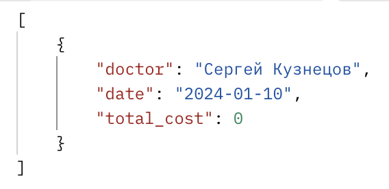

#  Реализация серверной части приложения средствами django и djangorestframework в соответствии с заданием из текста работы.

## Описание моего варианта

Задание 10
Создать программную систему, предназначенную для администратора лечебной
клиники.
Прием пациентов ведут несколько врачей различных специализаций. На каждого
пациента клиники заводится медицинская карта, в которой отражается вся
информация по личным данным больного и истории его заболеваний (диагнозы). При
очередном посещении врача в карте отражается дата и время приема, диагноз, текущее
состояние больного, рекомендации по лечению. Так как прием ведется только на
коммерческой основе, после очередного посещения пациент должен оплатить
медицинские услуги (каждый прием оплачивается отдельно). Расчет стоимости
посещения определяется врачом согласно прейскуранту по клинике.
Для ведения внутренней отчетности необходима следующая информация о врач:
фамилия, имя, отчество, специальность, образование, пол, дата рождения и дата начала
и окончания работы в клинике, данные по трудовому договору. Для каждого врача
составляется график работы с указанием рабочих и выходных дней.
Прием пациентов врачи могут вести в разных кабинетах. Каждый кабинет имеет
определенный режим работы, ответственного и внутренний телефон.
Перечень возможных запросов к базе данных:
1. Вывести по алфавиту список всех пациентов заданного врача с датами и
стоимостью приемов.
2. Вывести телефоны всех пациентах, которые посещали отоларингологов и
год рождения которых больше, чем 1987.
3. Вывести список врачей, в графике которых среди рабочих дней имеется
заданный.
4. Количество приемов пациентов по датам.
5. Вычислить суммарную стоимость лечения пациентов по дням и по врачам.
6. Список пациентов, уже оплативших лечение.
Перечень возможных отчетов:

1. Отчет о работе врачей в заданный промежуток времени с указанием списка
принятых пациентов, их диагноза и стоимости услуг с вычислением
суммарного дохода по каждому врачу.

## serializers
```python
class PaymentSerializer(serializers.ModelSerializer):
    patient = PatientSerializer()
    service = ServiceSerializer()

    class Meta:
        model = Payment
        fields = ['id', 'patient', 'service', 'amount', 'payment_date', 'is_paid']


class AppointmentSerializer(serializers.ModelSerializer):
    patient = PatientSerializer()
    doctor = DoctorSerializer()
    cabinet = CabinetSerializer()
    service = ServiceSerializer()

    class Meta:
        model = Appointment
        fields = ['id', 'patient', 'doctor', 'cabinet', 'service', 'appointment_date', 'appointment_time']


class DoctorPatientSerializer(serializers.ModelSerializer):
    doctor = DoctorSerializer()
    patient = PatientSerializer()

    class Meta:
        model = DoctorPatient
        fields = ['id', 'doctor', 'patient', 'date_started', 'date_ended']


class DoctorCabinetSerializer(serializers.ModelSerializer):
    doctor = DoctorSerializer()
    cabinet = CabinetSerializer()

    class Meta:
        model = DoctorCabinet
        fields = ['id', 'doctor', 'cabinet', 'date_assigned']
```
Описание
PatientSerializer - Сериализует объекты модели Payment, включая информацию о пациенте и услуге.
Поля:

id: Уникальный идентификатор платежа.
patient: Информация о пациенте.
service: Информация об услуге.
amount: Сумма платежа.
payment_date: Дата и время платежа.
is_paid: Флаг, указывающий, оплачен ли платеж.

AppointmentSerializer - Сериализует объекты модели Appointment, включая информацию о пациенте, враче, кабинете и услуге.
Поля:

id: Уникальный идентификатор записи на прием.
patient: Информация о пациенте.
doctor: Информация о враче.
cabinet: Информация о кабинете.
service: Информация об услуге.
appointment_date: Дата записи на прием.
appointment_time: Время записи на прием.

DoctorPatientSerializer - Сериализует объекты модели DoctorPatient, включая информацию о враче и пациенте.
Поля:

id: Уникальный идентификатор связи врача и пациента.
doctor: Информация о враче.
patient: Информация о пациенте.
date_started: Дата начала лечения.
date_ended: Дата окончания лечения.

DoctorCabinetSerializer - Сериализует объекты модели DoctorCabinet, включая информацию о враче и кабинете.
Поля:

id: Уникальный идентификатор назначения кабинета врачу.
doctor: Информация о враче.
cabinet: Информация о кабинете.
date_assigned: Дата назначения кабинета врачу.

## Примеры запросов
```python
http://127.0.0.1:8000/api/appointments/
выводит
[
  {
    "id": 1,
    "patient": {
      "id": 3,
      "first_name": "Иван",
      "last_name": "Иванов",
      "middle_name": "Иванович",
      "address": "Москва, улица Пушкина, дом 10",
      "phone_number": "89991112233",
      "birth_date": "1990-05-15"
    },
    "doctor": {
      "id": 3,
      "first_name": "Алексей",
      "last_name": "Смирнов",
      "sex": "М",
      "education": "Высшее медицинское",
      "birth_date": "1985-03-10",
      "speciality": "Хирург"
    },
    "cabinet": {
      "id": 1,
      "number": "101"
    },
    "service": {
      "id": 3,
      "service_name": "Консультация",
      "description": "Консультация терапевта"
    },
    "appointment_date": "2024-01-05",
    "appointment_time": "10:00:00"
  },
]

http://127.0.0.1:8000/api/cabinets/
выводит
[
  {
    "id": 1,
    "number": "101"
  },
  {
    "id": 2,
    "number": "101"
  }
]

http://127.0.0.1:8000/api/doctor-cabinets/
выводит
[
  {
    "id": 1,
    "doctor": {
      "id": 8,
      "first_name": "Ivan",
      "last_name": "Petrov",
      "sex": "M",
      "education": "Medical University",
      "birth_date": "1980-01-01",
      "speciality": "Otolaryngologist"
    },
    "cabinet": {
      "id": 4,
      "number": "101"
    },
    "date_assigned": "2020-01-01"
  },
]

http://127.0.0.1:8000/api/doctor-schedules/
[
  {
    "id": 1,
    "doctor": {
      "id": 4,
      "first_name": "Алексей",
      "last_name": "Смирнов",
      "sex": "М",
      "education": "Высшее медицинское",
      "birth_date": "1985-03-10",
      "speciality": "Хирург"
    },
    "work_date": "2024-01-05",
    "start_time": "09:00:00",
    "end_time": "17:00:00",
    "is_working": true
  }
]

http://127.0.0.1:8000/api/medical-cards/
[
  {
    "id": 1,
    "patient": {
      "id": 2,
      "first_name": "Иван",
      "last_name": "Иванов",
      "middle_name": "Иванович",
      "address": "Москва, улица Пушкина, дом 10",
      "phone_number": "89991112233",
      "birth_date": "1990-05-15"
    },
    "record_date": "2024-01-01",
    "diagnosis": "Грипп"
  },
]
```
## Djoser
```python
метод POST
создания пользователя 
http://127.0.0.1:8000/api/auth/users/

Метод POST
Получение токена
http://127.0.0.1:8000/api/auth/token/login

Метод GET
Получение пользователя по токену
http://127.0.0.1:8000/api/auth/users/me/

Метод POST
Удаления пользователя
http://127.0.0.1:8000/auth/token/logout/
```

## Аналитические запросы
1. Вывести по алфавиту список всех пациентов заданного врача с датами и
стоимостью приемов.

Запрос  http://localhost:8000/api/doctors/6/appointments/


2. Вывести телефоны всех пациентах, которые посещали отоларингологов и
год рождения которых больше, чем 1987.

Запрос http://localhost:8000/api/otolaryngologist-patients/


3. Вывести список врачей, в графике которых среди рабочих дней имеется
заданный.

Запрос http://127.0.0.1:8000/api/doctors-workday/?date=2024-01-10


4. Количество приемов пациентов по датам.

Запрос http://127.0.0.1:8000/api/count-by-date/?date=2024-01-10


5. Вычислить суммарную стоимость лечения пациентов по дням и по врачам.

Запрос http://127.0.0.1:8000/api/total-cost-by-day/?date=2024-01-10




6. Список пациентов, уже оплативших лечение.

Запрос http://127.0.0.1:8000/api/paid-patients/


